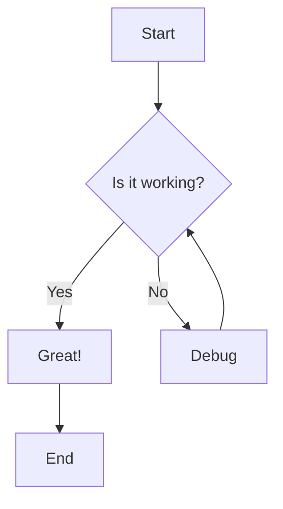
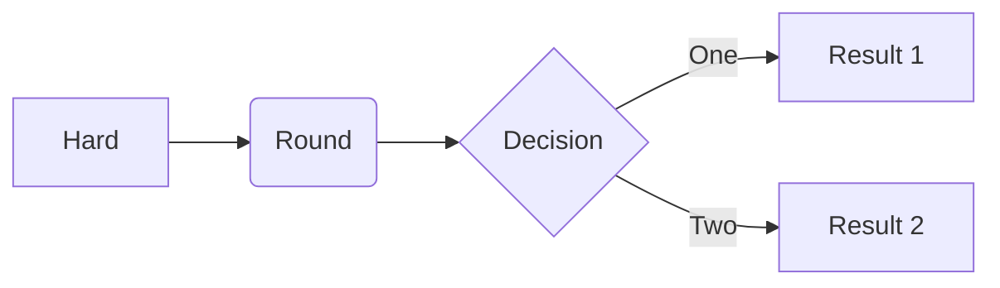
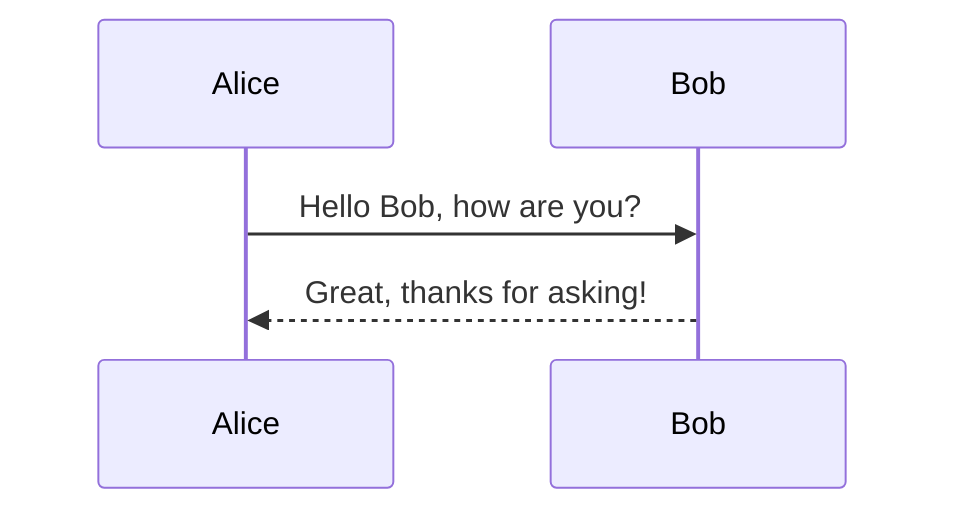

# Markdown Preview Test

This is a test markdown file to verify the preview functionality works correctly.

## Regular Markdown Features

- **Bold text**
- *Italic text*
- `inline code`
- [Link example](https://example.com)

### Code Block
```javascript
function hello() {
  console.log("Hello, World!");
}
```

## Mermaid Diagram Test



## Flowchart Example



## Sequence Diagram



## Math (KaTeX)

Inline math: $E = mc^2$

Block math:
$$
\int_0^\infty e^{-x^2} dx = \frac{\sqrt{\pi}}{2}
$$